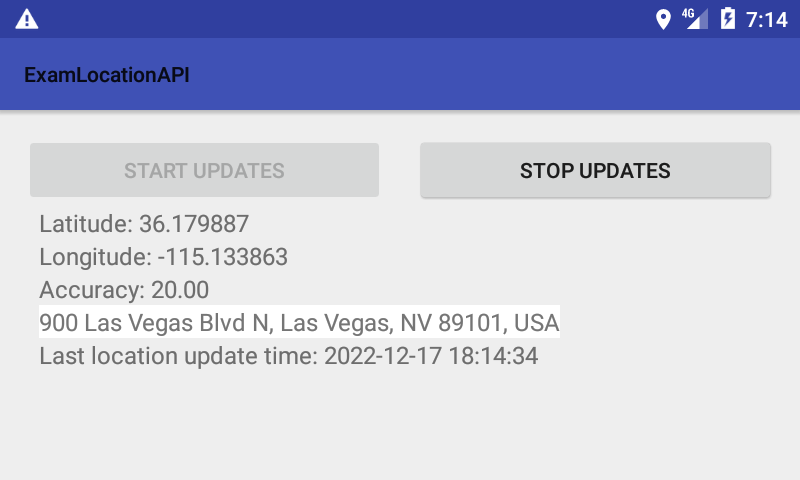

# Android-Fused-location-provider-example
Android example using the Google Play services location APIs
com.google.android.gms:play-services-location release 21.0.1

Based on Yukari Sakurai "https://github.com/sakurabird/Android-Fused-location-provider-example"
"https://developers.google.com/android/guides/setup"
"https://developer.android.com/training/location/request-updates"

Added: Requesting runtime permission, Asking Google Play Service APK, accuracy, address

